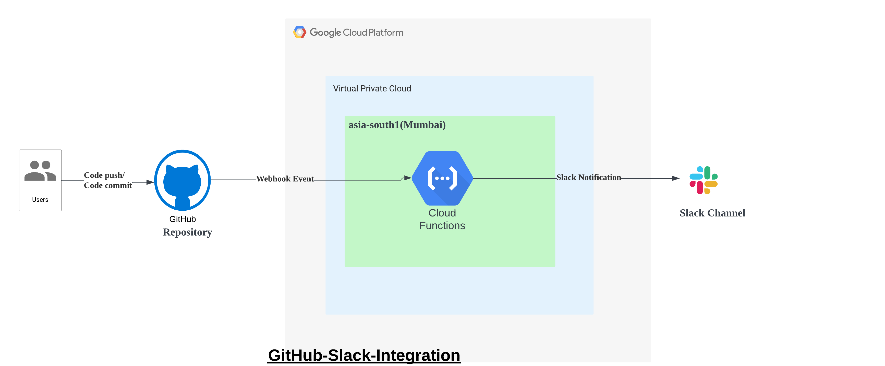

# GitHub-Slack-Integration

## Overview

This project implements a Google Cloud Platform (GCP) Cloud Function that sends Slack messages whenever there is any change in a specified GitHub repository. It leverages GCP service Cloud Functions, GitHub Webhook and Slack API.

## Features

- **GitHub Integration:** Monitors a specific GitHub repository for changes using GitHub Webhooks.
- **Slack Integration:** Sends notifications to a designated Slack channel when a change occurs.

## Architecture

1. **GitHub Webhook:** GitHub webhook is configured to trigger a Cloud Function endpoint whenever there is a change event on the specified repository like code push/code commit.
2. **Cloud Function:** The Cloud Function is triggered by the GitHub webhook and retrieves information about the changes made to the repository.
3. **Slack Notification:** The Cloud Function responsible for sending Slack notifications formats the message and sends it to the specified Slack channel or user using the Slack webhook URL.

## Pre-Requisites
1. A Google Cloud account(free tier/billing account setup)
2. A GitHub repository
3. A Slack Account

## Implementations

## Future Plans

- Add support for monitoring multiple GitHub repositories.
- Sending customizable notifications on details as to what changes were made.