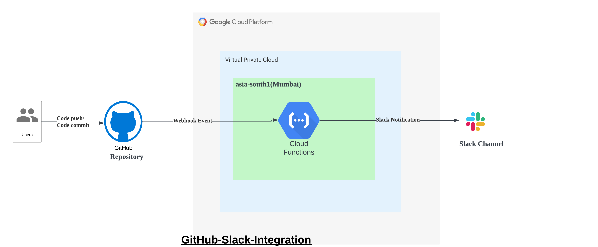
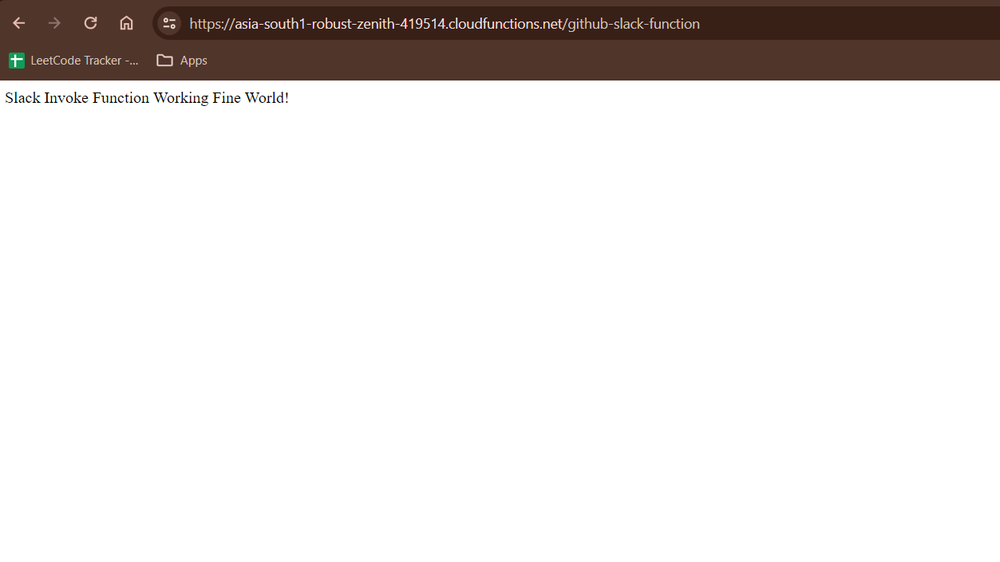
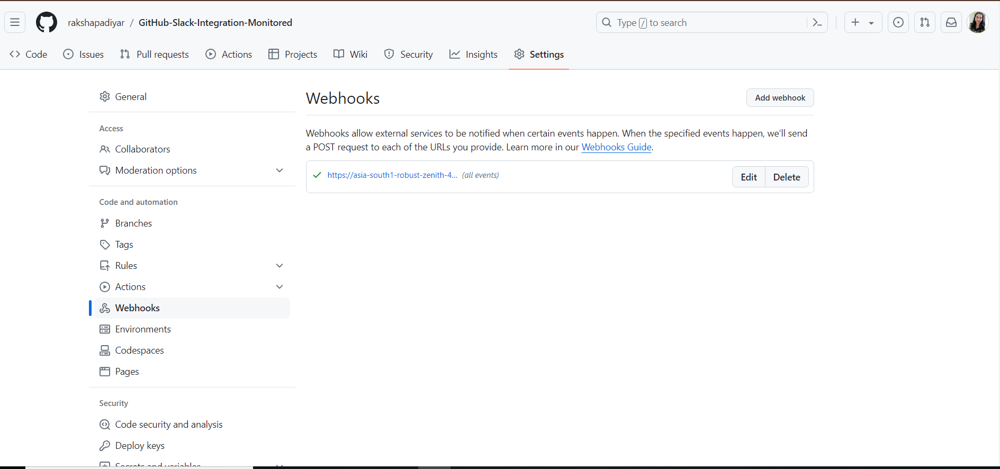

# GitHub-Slack-Integration

## Overview

This project implements a Google Cloud Platform (GCP) Cloud Function that sends Slack messages whenever there is any change in a specified GitHub repository. It leverages GCP service Cloud Functions, GitHub Webhook and Slack API.

## Features

- **GitHub Integration:** Monitors a specific GitHub repository for changes using GitHub Webhooks.
- **Slack Integration:** Sends notifications to a designated Slack channel when a change occurs.

## Architecture



1. **GitHub Webhook:** GitHub webhook is configured to trigger a Cloud Function endpoint whenever there is a change event on the specified repository like code push/code commit.
2. **Cloud Function:** The Cloud Function is triggered by the GitHub webhook and retrieves information about the changes made to the repository.
3. **Slack Notification:** The Cloud Function responsible for sending Slack notifications formats the message and sends it to the specified Slack channel or user using the Slack webhook URL.

## Pre-Requisites
1. A Google Cloud account(free tier/billing account setup)
2. A GitHub repository
3. A Slack Account

## Implementations

- Enabled Cloud Functions API for the project.   

- Deployed a cloud function with the following specifications
    - Environment : 2nd gen
    - Function Name : github-slack-function
    - Region : ap-south1(Mumbai)
    - Trigger type : HTTPS
    - Authentication type : Allow unauthenticated invocations 
    - Entry Point Runtime : Python 3.8  

- Triggered the function by a https req over browser at the endpoint https://asia-south1-robust-zenith-419514.cloudfunctions.net/github-slack-function


### GitHub Integration

- Created a new public repository on Github (named GitHub-Slack-Integration-Monitored). Added a Webhook for the repository.

- Added the CloudFunction URL as the payload URL (the URL that must be triggered upon an event).

- Selected an option that enables every events to trigger this webhook. Disabled SSL verfication.
  Webhook successfully added.
  
  

- Added a simple print statement in the entry point script to test if the changes made to Github repo did trigger the cloud function.
    ```
    print("GitHub webhook received v2")
    ```

- Made a small update in the README.md file and committed the changes.   

- Checked the logs of the cloud function to find that the print statement was logged. This indicated that the cloud function was infact triggered and executed when there was an event(readme update) in the GitHub repository.

### Slack Integration
-

## Future Plans

- Add support for monitoring multiple GitHub repositories.
- Sending customizable notifications on details as to what changes were made.